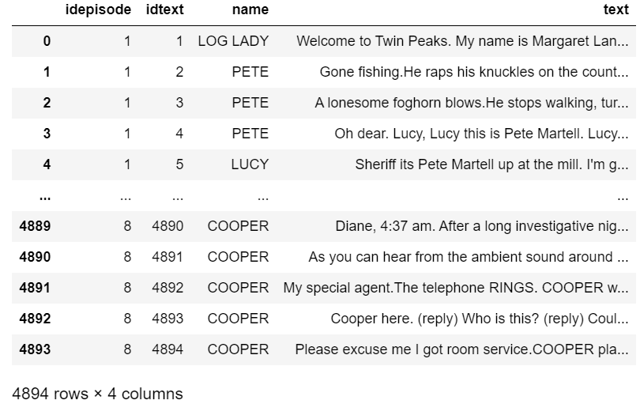
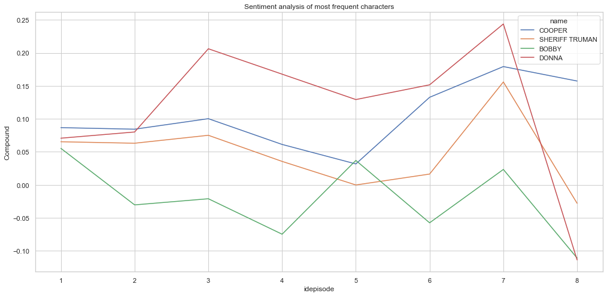
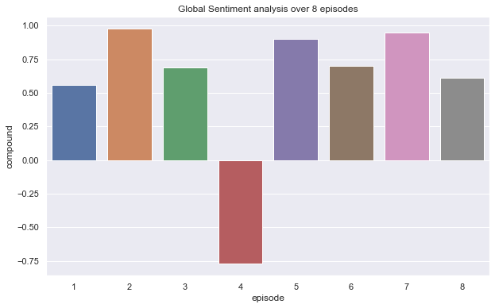

# 4-Project_sentiment_analysis
## Selma Laarabi
## Introduction
In this project we are going to use the ETL methods to perform sentiment analysis on the script of the first season of the Twin Peaks series.
to achieve this, I have extracted the scripts from a TXT format data source, and performed the necessary transformations to make my data ready for loading ot into MySQL database.

Using the newly created MySQL database, I have created and exposed an API to retrieve the script as well as the sentiment analysis(compound), supporting different parameters (by character, by episode..)

## What is Twin Peaks series ?
The series follows an investigation, headed by FBI Special Agent Dale Cooper and local Sheriff Harry S. Truman, into the murder of homecoming queen Laura Palmer in the fictional town of Twin Peaks, Washington.
## ETL process 
Step 1 : After getting the script for 8 episodes of the show from Kaggle, the transformation step began, where I had to convert the text into a data set and perform the necessary transformations.    
Step 2 : Now that the data set is clean, it's time to load it into  MySQL, first we create the schema and then we start loading data into the tables.     
step 3 : Using Flask I created an API that connects to my database and retrieves series related data as well as performs sentiment analysis by character and by episode.   

              http://127.0.0.1:9000/sa/allepisodes

## Sentiment analysis
The sentiment analysis was performed using the API queries for the characters with the most dialogue, Sheriff Truman and Agent Cooper seem to be neutral overall, that is mainly because they are leading the investigation, and requiered to be impartial.

For the second sentiment analysis, we focused on episode to get the overall sentiment over the course of the season.

